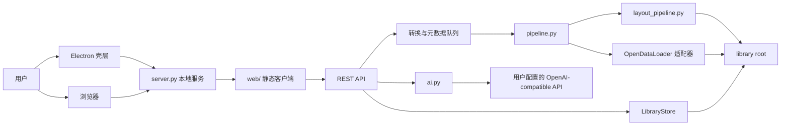

# My Scholar

My Scholar 是一个本地优先的跨平台学术 PDF 阅读器。它把 PDF 转成连续阅读的 HTML，并在同一个桌面应用中提供文献管理、元数据检索、翻译、标注、笔记和文章问答。

当前版本为 `0.1.0`，是一个面向单用户本地部署的开源版本。PDF、译文、笔记、标注、设置和 AI 配置默认保存在本机，不需要注册账号或连接远程用户服务。

## 主要功能

- 并行导入多个 PDF，并按文件内容哈希去重。
- 自动读取 PDF/XMP 元数据，并按需查询 DOI、Crossref、DataCite、arXiv 和 PubMed。
- 使用文件夹、分类、保存视图和紧凑表格管理文献，并可在表头拖动调整列宽。
- 宽屏列设置工作区支持横向排序、改名和显隐；系统列可隐藏，自定义列可快速删除。
- 单击选择、双击打开、长按拖拽归类，并支持右键菜单和多选操作。
- 连续 HTML 阅读，支持目录、字号、行距和页边距设置。
- 支持选区即时翻译、全文翻译、公式占位保护和本地译文缓存。
- 分离 AI 阅读重点与个人高亮笔记，避免把系统建议误认为用户标注。
- 文章笔记与标注笔记使用统一编辑器，支持上传或从剪贴板粘贴图片。
- 阅读助手支持文章问答、文本或图片加入 Chat，以及拖拽调整侧栏宽度。
- 支持在设置页分别填写用户自己的 OpenAI-compatible 翻译 API 与文章助手 API；密钥只写入本机设置文件，不回显到页面。
- 图片支持灯箱查看、空白处或 `Esc` 关闭、复制图片和加入 Chat。
- 页面字体、阅读器字体、系统重点色和快捷键可以在设置页调整。
- 自动跟随系统明暗模式，并为减少动态效果的系统偏好提供兼容样式。

## 快速启动

### 基础要求

| 组件 | 用途 | 是否必需 |
| --- | --- | --- |
| Node.js 与 npm | Electron 桌面壳层和前端检查 | 桌面模式必需 |
| Python 3.9+ | 本地 HTTP 服务、任务队列和数据存储 | 必需 |
| Poppler (`pdfinfo`, `pdftoppm`) | 页数识别、页图和高分辨率裁剪 | 推荐 |
| MinerU 或匹配的 content-list sidecar | 版面感知语义转换 | 可选 |
| Java 11+ 与 OpenDataLoader PDF CLI | MinerU 不可用时的转换回退 | 可选 |
| Pandoc | LaTeX 转 MathML | 可选 |
| PyMuPDF (`fitz`) | PDF 元数据和视觉裁剪 | 可选 |
| Playwright | 浏览器交互回归测试 | 仅测试需要 |

核心 Python 服务主要使用标准库。执行完整的 `npm run check` 时，Python 构建还必须提供 `hashlib.scrypt`；可运行 `python3 -c "import hashlib; assert hasattr(hashlib, 'scrypt')"` 检查。导入新 PDF 至少要有匹配的 content-list sidecar、MinerU 或 OpenDataLoader 中的一条可用路径；这些路径都不可用时，应用仍可阅读已有文献，但不能完成新文献的语义转换。

### Electron 桌面版

```bash
git clone git@github.com:ShiLong-CN/guzi-scholar.git
cd guzi-scholar/apps/desktop
npm install
npm run dev
```

也可以从仓库根目录在 Finder 中双击 `apps/desktop/run-my-scholar.command`。如需指定其他 Python 解释器，可在启动前设置 `MY_SCHOLAR_PYTHON=/absolute/path/to/python`。

启动时，Electron 会在 `127.0.0.1` 的随机端口运行 `server.py`，再加载本地 Web 界面。关闭桌面窗口时，主进程会停止对应的 Python 服务。

不要直接双击 `node_modules/electron/dist/Electron.app`。该文件只是 Electron 运行时，不包含 My Scholar 的项目入口。

### 浏览器版

```bash
./run.sh --host 127.0.0.1 --port 8765
```

然后打开 <http://127.0.0.1:8765>。

### 数据目录

源码开发和浏览器模式默认把状态与文献都放在 `apps/desktop/data/`。打包后的桌面应用会分开保存：设置和文献库位置记录位于 Electron `userData/state/`，PDF、索引、译文、笔记和标注位于 `userData/library/` 或用户在设置中选定的文献库。可以通过环境变量指定一次性测试目录：

```bash
MY_SCHOLAR_DATA_DIR=/absolute/path/to/my-scholar-data npm run dev
```

`MY_SCHOLAR_DATA_DIR` 指定状态目录；没有另外设置时，源码开发模式也把它作为文献库。`MY_SCHOLAR_LIBRARY_DIR` 可单独固定文献库目录，但启用后应用内的路径选择会被锁定。安装版正常使用时无需设置这两个变量。

服务使用操作系统文件锁，禁止两个 My Scholar 进程同时写入同一个数据目录。

## AI 服务配置

翻译和文章助手使用两套独立的 OpenAI-compatible 配置。用户可以在设置页填写 Base URL、API Key 和模型；配置只保存在当前设备的 `settings.json` 中，服务端接口只返回是否已配置，不返回真实密钥。

从不含真实密钥的 `config.example.json` 创建本地 `developer.tokens.json`，并收紧文件权限：

```bash
cp config.example.json developer.tokens.json
chmod 600 developer.tokens.json
```

`config.example.json` 提供不含真实密钥的结构示例：

```json
{
  "translation": {
    "base_url": "https://translation-gateway.example/v1",
    "api_key": "replace-with-local-secret",
    "model": "translation-model"
  },
  "chat": {
    "base_url": "https://chat-gateway.example/v1",
    "api_key": "replace-with-local-secret",
    "model": "chat-model"
  }
}
```

`developer.tokens.json` 仅供源码开发和服务器部署使用，已被 Git 与应用打包排除，禁止提交真实密钥。生产服务器通过 `MY_SCHOLAR_DEVELOPER_TOKENS_FILE` 指向权限受限的配置文件；凭据疑似泄漏时应立即轮换。

保存设置后，翻译和 Chat 请求会直接发送到用户填写的服务地址。用户未配置某项服务或连接失败时，PDF 转换、文献管理、阅读、标注和本地笔记仍然可用。源码开发也可以用 `developer.tokens.json` 作为可选的本地回退配置。

## 系统架构



| 层 | 入口 | 职责 |
| --- | --- | --- |
| 桌面壳层 | `electron/launcher.cjs`, `electron/main.cjs` | 启动本地服务、创建安全窗口、管理生命周期和崩溃日志 |
| Web 客户端 | `web/index.html`, `web/styles.css`, `web/app.js` | 文献库、阅读器、翻译、标注、笔记、助手和设置 |
| HTTP 编排层 | `server.py` | 静态资源、REST 路由、任务队列、产物访问和后台线程 |
| 转换适配层 | `pipeline.py`, `layout_pipeline.py` | 后端选择、版面解析、公式/引用/图表构建和验证 |
| 文献库数据 | `library_store.py` | 文件夹、属性、视图、阅读状态、列设置和元数据锁定 |
| 可选服务 | `bibliography.py`, `ai.py` | 本地/在线书目匹配、翻译、问答、阅读重点和表格复核 |
| 本机状态 | state root | 设置、AI 状态历史和文献库位置记录 |
| 文献持久化 | library root | PDF、HTML、JSON、译文、笔记、标注和文献库索引 |

## 核心数据流

### PDF 导入与去重

1. 客户端把选择或拖入的 PDF 加入导入队列。
2. `POST /api/jobs` 上传文件并记录目标文件夹。
3. 服务端按 PDF SHA-256 和字节数复用已有任务。
4. 新文件进入转换队列；元数据任务在独立线程池运行。
5. 默认启用两个转换 worker 和三个元数据 worker，避免多文件串行阻塞。

### PDF 转换

`MY_SCHOLAR_BACKEND=auto` 时，转换器按以下顺序选择：

1. `MY_SCHOLAR_LAYOUT_JSON` 指定的 content-list。
2. 与 PDF 匹配的缓存 sidecar。
3. `MY_SCHOLAR_MINERU` 或 PATH 中的 MinerU。
4. OpenDataLoader PDF CLI 回退。

两条路径都会生成 `manifest.json` 和 `validation.json`。复杂图表优先保留 PDF 原始高分辨率裁剪；公式优先转换为 MathML，无法确认时保留可见 TeX。

### 元数据检索

1. 读取结构化文档、PDF XMP 和文件名。
2. 识别 DOI、arXiv ID 或 PMID。
3. 根据设置查询 DOI 内容协商、Crossref、DataCite、arXiv 或 PubMed。
4. 合并带来源与置信度的候选结果。
5. 保留用户手动锁定的字段；在线失败不会让 PDF 转换失败。

### 文献库与列设置

- 默认列为名称、研究主题、重要程度、阅读状态和接收/来源；标题列默认隐藏。旧版转换任务“状态”列已从可配置列退役，用户维护的“阅读状态”仍保留。
- 系统列始终保留，可以在列设置中隐藏；自定义列提供快捷删除，并同步清理各文献中对应的属性值。
- 列设置在宽屏上使用横向工作区和双列卡片，在窄屏上自动改为纵向单列。
- 文献列表采用紧凑行高和字号，重要程度、阅读状态与行内操作保持可直接编辑。

### 阅读、翻译与笔记

1. 阅读器在隔离 iframe 中加载 `document.html`。
2. 文件夹、阅读状态和列设置写入 `library.json`。
3. 个人标注写入 `annotations.json`；AI 阅读重点单独写入 `ai-highlights.json`。
4. 文章笔记写入 `notes.md`，粘贴的图片存入文献任务目录。
5. 翻译缓存按模型配置、目标语言、块 ID 和原文哈希隔离。
6. 安装版的 Chat 历史和轻量界面状态以原子文件保存在 state root 的 `renderer-state/`；浏览器开发模式回退到 `localStorage`。每次请求可发送最多 120,000 字符的文章上下文、最近 20 条对话和用户明确加入的图片。

## 目录与文件职责

```text
guzi-scholar/
├── package.json / capacitor.config.json  # 工作区入口与移动端 Capacitor 壳
├── apps/desktop/                 # 共用的桌面与 Web 业务主工程
│   ├── server.py                 # HTTP API、队列和服务编排
│   ├── pipeline.py               # 转换后端选择和 ODL 适配
│   ├── layout_pipeline.py        # 版面感知 HTML 构建
│   ├── library_store.py          # 文献库 schema 与 CRUD
│   ├── bibliography.py           # 本地与在线元数据检索
│   ├── ai.py / config.py         # AI 适配器与本地配置解析
│   ├── electron/                 # Electron 主进程、预加载和启动器
│   ├── web/                      # 页面、样式和客户端交互
│   ├── tests/                    # Python 单元测试与浏览器 smoke
│   └── data/                     # 开发数据，不进入 Git
├── platforms/windows/            # Windows 打包、启动和验收脚本
├── platforms/macos/              # macOS 发布配置预留目录
├── ios/ / android/               # 加载只读展示站的 Capacitor 工程
├── mobile-shell/                 # 本地移动壳占位页；当前被 Git 忽略
└── webseit/                      # 只读展示站部署脚本
```

`web/app.js` 当前保留为单一兼容入口，并按壳层、导入、文献库、阅读器、翻译、AI 和设置的顺序组织。拆分为 ES modules 前，需要先把活动文献和 iframe 生命周期变成显式依赖，避免跨标签异步竞态。

## 本地数据

### 文献库索引

`<library-root>/library.json` 使用 schema v4，保存：

- 系统文件夹和用户文件夹；
- 阅读状态、重要程度、研究主题、来源和自定义属性；
- 分类字段、列显示、列顺序和列宽；
- 文献组织信息和元数据；
- 保存视图及筛选条件。

### 单篇文献目录

```text
<library-root>/jobs/<job-id>/
├── source.pdf / upload.pdf
├── document.html / document.json
├── manifest.json / validation.json
├── pages/ / assets/images/
├── translations.json
├── annotations.json
├── notes.md
├── ai-highlights.json / ai-review.json
└── content/
    ├── english/blocks.json
    ├── chinese/blocks.json
    ├── notes/
    └── annotations/
```

`data/`、`.backups/`、`node_modules/`、`config.local.json`、`developer.tokens.json`、日志和缓存均不会进入 Git。真实凭据和用户数据不得提交。

`<state-root>/settings.json` 保存本机界面偏好和 AI 配置，并以 `0600` 权限写入；它不包含在 Git 中。

## 隐私边界

- PDF、译文、笔记和标注默认只保存在本机文献库；设置和 AI 密钥默认只保存在本机状态目录。
- 开启在线元数据检索后，文献标识符、标题或作者候选会发送给 DOI/Crossref/DataCite/arXiv/PubMed 服务。
- 翻译会发送选中文本或文章块；Chat 可发送最多 120,000 字符的文章上下文、最近 20 条消息和用户明确加入的图片；自动重点与表格复核也会发送对应论文片段。
- 翻译、Chat、自动重点和表格复核会把相应文本发送到用户自己配置的 AI 服务；请根据服务商政策评估数据敏感性。
- 当前没有文献云同步；外部元数据与 AI 服务仍受各自的安全和隐私边界约束。

## 主要 HTTP API

服务只应绑定到 `127.0.0.1`。

| 方法与路径 | 作用 |
| --- | --- |
| `GET /api/health` | 服务、worker 和 AI 配置状态 |
| `GET/POST/PUT /api/settings` | 本机界面、快捷键和元数据设置；不返回 API key |
| `GET/POST /api/jobs` | 列出或导入文献 |
| `GET /api/jobs/<id>` | 查询任务与产物 |
| `GET /api/library` | 获取文献库快照 |
| `POST/PATCH/DELETE /api/library/...` | 管理文件夹、属性、视图和文献状态 |
| `GET/PATCH /api/library/items/<id>/metadata` | 读取或修订元数据 |
| `POST /api/library/items/<id>/metadata/retrieve` | 重新检索元数据 |
| `GET/POST/PATCH/DELETE /api/jobs/<id>/annotations...` | 管理个人标注 |
| `GET/PUT /api/jobs/<id>/notes` | 读取或保存文章笔记 |
| `POST /api/jobs/<id>/note-assets` | 保存笔记图片 |
| `GET /api/jobs/<id>/translations` | 读取译文缓存 |
| `POST /api/jobs/<id>/translate` | 翻译并写入缓存 |
| `POST /api/jobs/<id>/chat` | 文章问答 |
| `GET/POST /api/jobs/<id>/auto-highlights` | AI 阅读重点 |
| `GET/POST /api/jobs/<id>/ai-review` | 表格 AI 复核 |
| `POST /api/mathml` | 将受支持的公式转换为 MathML |
| `POST /api/ai/test` | 测试两项用户配置的 AI 服务 |

服务只公开白名单内的任务产物，并验证解析后的路径，防止跨文献目录访问。

## 环境变量

### 服务与并发

| 变量 | 默认值 | 作用 |
| --- | --- | --- |
| `MY_SCHOLAR_DATA_DIR` | 开发版 `./data` | 状态目录；安装版默认使用 Electron `userData/state` |
| `MY_SCHOLAR_LIBRARY_DIR` | 开发版跟随状态目录 | 文献库目录；安装版默认使用 `userData/library` 或设置中保存的位置；显式设置后禁用应用内改址 |
| `MY_SCHOLAR_HOST` | `127.0.0.1` | 直接运行 `server.py`/浏览器模式的绑定地址；Electron 固定为 `127.0.0.1` |
| `MY_SCHOLAR_PORT` | `8765` | 直接运行 `server.py`/浏览器模式的端口；Electron 使用随机端口 |
| `MY_SCHOLAR_MAX_UPLOAD_BYTES` | `104857600` | 单个 PDF 上传上限 |
| `MY_SCHOLAR_PARALLEL_IMPORT` | `1` | 启用并行转换和元数据检索 |
| `MY_SCHOLAR_CONVERSION_WORKERS` | `2` | 转换 worker，范围 1–2 |
| `MY_SCHOLAR_METADATA_WORKERS` | `3` | 元数据 worker，范围 1–4 |
| `MY_SCHOLAR_SHELL` | `reference` | 使用 `classic`/`legacy` 回滚壳层 |
| `MY_SCHOLAR_PYTHON` | `/usr/bin/python3` | 源码开发模式使用的 Python；安装版使用随应用打包的运行时 |
| `MY_SCHOLAR_READONLY` | 未设置 | 直接运行服务时启用只读展示模式；Electron 会清除此变量并保持可写 |
| `MY_SCHOLAR_LANDING_FILE` | 空 | 直接运行只读服务时使用的首页文件；普通 Electron 启动不使用 |

### 转换器

| 变量 | 默认值 | 作用 |
| --- | --- | --- |
| `MY_SCHOLAR_BACKEND` | `auto` | `auto`、`layout` 或 `odl` |
| `MY_SCHOLAR_LAYOUT_JSON` | 自动发现 | 指定 content-list sidecar |
| `MY_SCHOLAR_MINERU` | 自动探测 | MinerU 可执行文件 |
| `MY_SCHOLAR_DISABLE_MINERU` | 未设置 | 禁止自动调用 MinerU |
| `MY_SCHOLAR_FORMULA_DIR` | 自动发现 | 指定 Nougat 公式识别结果目录 |
| `MY_SCHOLAR_ODL_JAR` | 代码自动路径 | OpenDataLoader CLI JAR；CI 由 `scripts/fetch-opendataloader.sh` 固定下载并校验 |
| `MY_SCHOLAR_ODL_VISUAL_FALLBACK` | `1` | ODL 路径使用整页保真 HTML |
| `MY_SCHOLAR_PANDOC` | 自动探测 | Pandoc 可执行文件 |
| `MY_SCHOLAR_PAGE_DPI` | `144` | 页面图渲染密度 |
| `MY_SCHOLAR_VISUAL_DPI` | `300` | 图表裁剪密度 |

工具链会兼容旧仓库内布局、当前相邻仓库布局以及 `MY_SCHOLAR_TOOLCHAIN_ROOT`。发布构建会把 OpenDataLoader、最小 Java 运行时和页面渲染器装入应用包；CI 默认使用 OpenDataLoader PDF CLI `v2.5.1`，开发环境仍可用上述变量覆盖路径。

### AI 与测试

| 变量 | 默认值 | 作用 |
| --- | --- | --- |
| `MY_SCHOLAR_DEVELOPER_TOKENS_FILE` | `./developer.tokens.json` | 可选的开发者 AI 回退配置文件 |
| `MY_SCHOLAR_AI_TIMEOUT` | `90` | AI 请求超时秒数 |
| `MY_SCHOLAR_AI_DISABLE_THINKING` | `1` | 请求兼容 Chat 模型关闭思考输出 |
| `MY_SCHOLAR_PLAYWRIGHT_MODULE` | 自动探测 | Playwright 包目录 |
| `MY_SCHOLAR_PLAYWRIGHT_EXECUTABLE` | 自动探测 | 浏览器可执行文件 |
| `MY_SCHOLAR_TEST_DATA` | 空 | 交互回归测试数据根目录 |

## 测试

### 语法与单元测试

```bash
npm run check
```

该命令执行 JavaScript/Shell 语法检查和自动发现的 `tests/test_*.py`。它不会启动主应用或修改正式文献库。确保命令中的 `python3` 指向提供 `hashlib.scrypt` 的解释器。

### 浏览器交互测试

```bash
npm run test:ui:document -- http://127.0.0.1:8766
npm run test:ui:features -- http://127.0.0.1:8766
npm run test:ui:translation -- http://127.0.0.1:8766
npm run test:ui:library -- http://127.0.0.1:8766
npm run test:ui:library-v3 -- http://127.0.0.1:8766
npm run test:ui:library-v4 -- http://127.0.0.1:8766
npm run test:ui:interactions -- http://127.0.0.1:8766
```

其中 `library-v3` 覆盖文献列表密度、列设置响应式布局和自定义列快捷删除，`library-v4` 覆盖列显隐、排序及交互回归；设置测试还会验证 AI 配置写入和密钥不回显。

UI smoke 会修改连接服务的数据目录。必须使用一次性数据副本：

```bash
QA_DATA=$(mktemp -d /private/tmp/my-scholar-qa.XXXXXX)
cp -R data/. "$QA_DATA"/
MY_SCHOLAR_DATA_DIR="$QA_DATA" ./run.sh --host 127.0.0.1 --port 8766
```

确认测试服务停止后再删除临时目录。

## 当前限制

- 本地 JSON 存储面向单用户、单写入进程，不支持多设备同步。
- PDF 结构质量取决于 MinerU、sidecar 或 OpenDataLoader 输出。
- AI 功能依赖用户提供的外部兼容服务；应用不内置模型，也不包含供应商密钥。首版不提供计费、文献云存储或多设备同步。
- 当前提供 HTML 阅读，不提供论文 Markdown 下载。
- 首版仅面向 Apple Silicon Mac，要求 macOS 12 或更高版本；浏览器模式只用于开发和回归。

## 项目边界与外部许可

My Scholar 采用独立实现，不包含第三方私有源码、品牌资源或私有 API。仓库包含自有的本地服务和平台脚本；它们同样需要独立完成安全、隐私与运维审计。二次开发和再发布必须遵守根目录 `NOTICE.md` 中的来源说明要求。

应用代码与外部转换器属于不同许可单元。发布或商业化前，应分别核对 Electron、MinerU、OpenDataLoader、Poppler、Pandoc、PyMuPDF 及其他依赖的版本和许可证。
